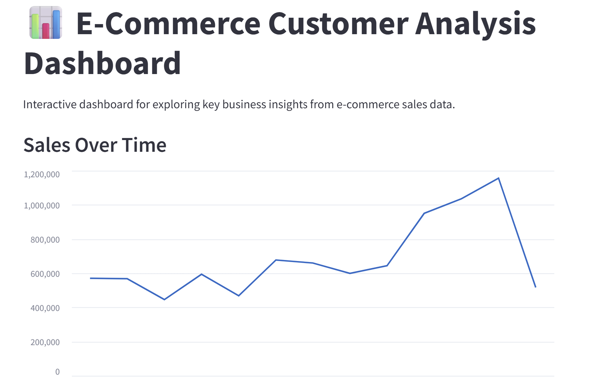

# Customer Segmentation & Sales Insights – E-Commerce Data


<!--  -->

A complete data analytics project featuring data cleaning, exploratory data analysis, customer segmentation (RFM), and an interactive Streamlit dashboard.


## Project Overview
This project demonstrates data analytics using an E-Commerce customer dataset. The goal is to analyze customer behavior, sales trends, and gain insights to support data-driven decision making.


## Tech Stack
- **Languages:** Python (Pandas, NumPy)
- **Visualization:** [Matplotlib](https://matplotlib.org/), [Seaborn](https://seaborn.pydata.org/)
- **Dashboard:** [Streamlit](https://streamlit.io/)
- **Environment:** [Jupyter Notebook](https://jupyter.org/)


## Dataset
- **Source:** [Kaggle – E-Commerce Data](https://www.kaggle.com/datasets/carrie1/ecommerce-data)  
- **Description:** Contains transactional data including `InvoiceNo`, `StockCode`, `Description`, `Quantity`, `InvoiceDate`, `UnitPrice`, `CustomerID`, and `Country`.  
- **Size:** ~500k rows, multiple countries  


## Project Workflow
1. **Data Cleaning:** Removed missing values, negative quantities, and duplicates; created `TotalPrice` for revenue analysis.  
2. **Exploratory Data Analysis (EDA):** Identified sales trends, top products, and customer distribution.  
3. **RFM Segmentation:** Grouped customers by Recency, Frequency, and Monetary value.  
4. **Advanced Insights:** Analyzed sales patterns by time and country; explored retention trends using cohort analysis to understand customer behavior over time.  
5. **Interactive Dashboard:** Built with Streamlit to explore data visually.
 


## Insights & Impact
This project demonstrates the ability to analyze e-commerce data, segment customers, and visualize trends using Python.

**Key Insights**
- **Top Products:** The 10 most purchased products are clearly identified, helping prioritize inventory or promotions.  
- **Monthly Sales Trends:** Revenue trends over time reveal growth patterns and seasonal changes.  
- **Customer Distribution:** The top countries by customer count and revenue are identified.  
- **Customer Segments:** RFM analysis visualizes segments based on Recency, Frequency, and Monetary value.  
- **Time-based Patterns:** Sales by hour or day-of-week provide insights into customer purchasing behavior.
- **Customer Retention:** Cohort analysis shows how customers from each month behave over time, revealing retention trends and repeat purchase patterns.


## Skills Demonstrated
- Data cleaning & preprocessing  
- Exploratory and statistical analysis  
- Data visualization (Matplotlib, Seaborn)  
- Customer segmentation & retention analysis (RFM, Cohort)  
- Streamlit dashboard development


## Interactive Dashboard
An interactive Streamlit app built for visual exploration of sales and customer insights.

**Features**
- View monthly sales trends
- Explore top-selling products
- Compare customer distribution by country

**Run the dashboard**

To run the dashboard on your local machine, execute:
```bash
streamlit run dashboard.py
```
You can also access the dashboard directly in your browser without running it locally:
[Streamlit App](https://irfanfetahovic-ecommerce-data-analysis-codedashboard-m1y05z.streamlit.app/)


## How to Run
1. Clone the repository:

   ```bash
   git clone https://github.com/irfanfetahovic/ecommerce-data-analysis.git
   cd ecommerce-data-analysis
   ```
2. Install dependencies:

   ```bash
   pip install -r requirements.txt
   ```
3. Download the dataset from Kaggle and place it in the data/ folder.
4. Open and run the Jupyter Notebook:

   ```bash
   jupyter notebook eda.ipynb
   ```
5. Run all cells to explore data, visualizations, and insights
6. Run the Streamlit dashboard:

   ```bash
   streamlit run dashboard.py
   ```
 


## Project Structure

```bash
/project-folder
├── data/                    # dataset
├── notebooks/               # Jupyter notebooks
├── dashboard.py             # Streamlit app
├── images/                  # charts and screenshots
├── README.md
└── requirements.txt
```


## License
This project is licensed under the MIT License.


👤 **Author:** Irfan Fetahović  
📧 **Email:** [irfanfetahovic@gmail.com](mailto:irfanfetahovic@gmail.com)  
💼 **Portfolio:** [GitHub](https://github.com/irfanfetahovic) | [LinkedIn](https://www.linkedin.com/in/irfan-fetahovic-28473923/)


